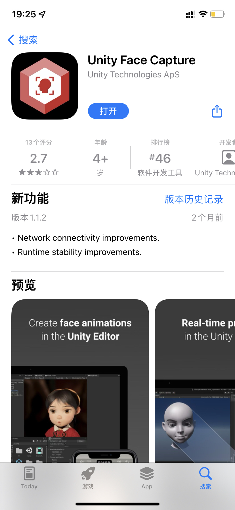

# Live3D

## About APP

面部捕捉重定向小测试，顺便东拼西凑实现了仿原神渲染和物理模拟等特性，属于是缝合各路大佬教程的技术验证产物。

## Getting Started

### Prerequisites

- 一台电脑：可以是Windows PC或者Mac
- 一支iOS设备：运行iOS14.6及以上并搭载Face ID模块**或者**A12及以上仿生芯片以便使用ARKit面部追踪能力

### Download

#### 电脑端

找找右边的Releases列表，找到对应系统的zip包下载就可以（macOS原生支持Intel和Apple Silicon）。

#### 移动端

进入App Store搜索“Unity Face Capture”下载安装。

### Documentation

1. 检查你的网络，电脑端与移动端应用通过网络通信，二者需处于同一局域网下并没有启用网络代理，确保电脑系统防火墙给予应用程序网络传入连接权限（在Windows上你可能还需要将Wi-Fi设置为专用连接）；

   

2. 解压电脑端zip包，Windows PC运行.exe程序，Mac运行.app应用，此时软件正在等待面捕设备连接；

3. 在iOS设备上打开Face Capture应用，使用自动搜索或者手动输入ip地址方式连接，首次连接可能需要手动填写ip地址（Windows和macOS可以分别使用ipconfig和ifconfig命令查询），端口设置为9000；

   

4. 🎉你可以将其添加到OBS等软件中愉快使用了。

   

## License

由于项目内使用付费插件，且为遵循人物模型配布协议，工程处于闭源状态，Demo软件包为技术预览程序请勿用于商业行为。

### 借物表

Model: miHoYo/观海

## Contact

- [BiliBili](https://space.bilibili.com/314598468?spm_id_from=333.1007.0.0)
